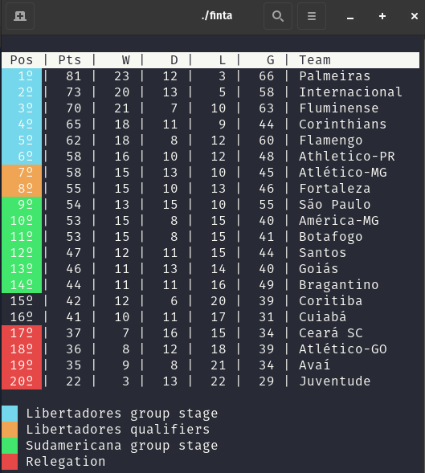
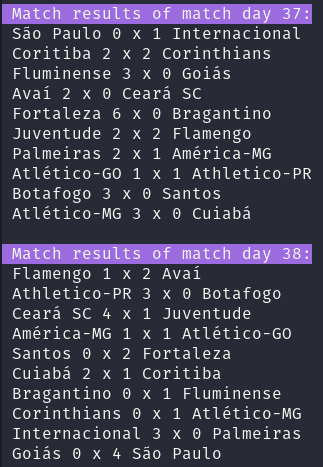
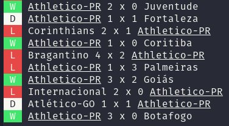

# FINTA (Football Insights & Tactical Analysis)

FINTA is a Football Score Tracker and Analytics System developed in C++. It allows you to track football match scores, player statistics, and team data, providing in-depth insights and analysis capabilities for enthusiasts, managers, and analysts.

## Dataset Used
* [Brasileirão Dataset](https://github.com/adaoduque/Brasileirao_Dataset)

## Features

* Show standings of the league

* Show match results by round

* Show match results of a specific team
